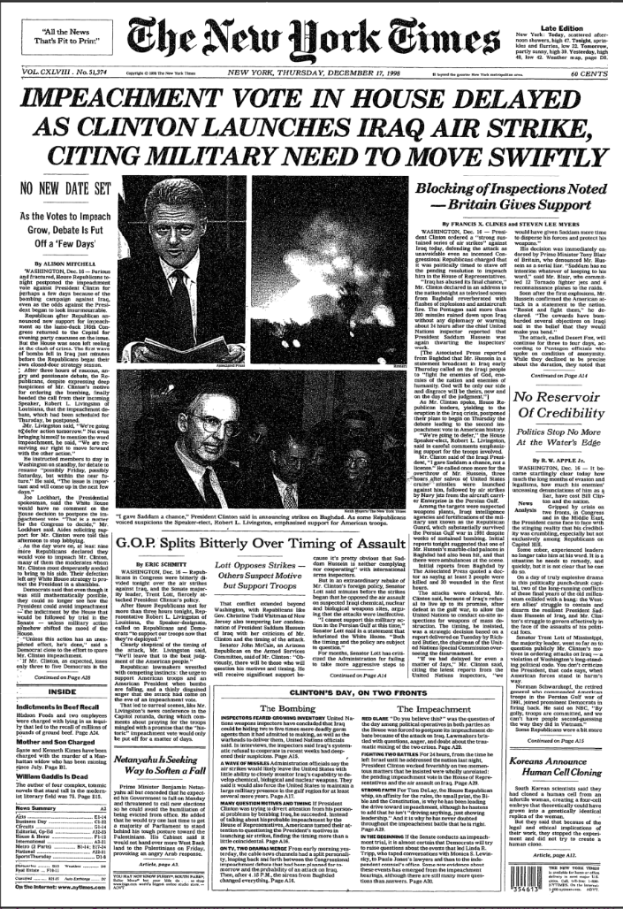
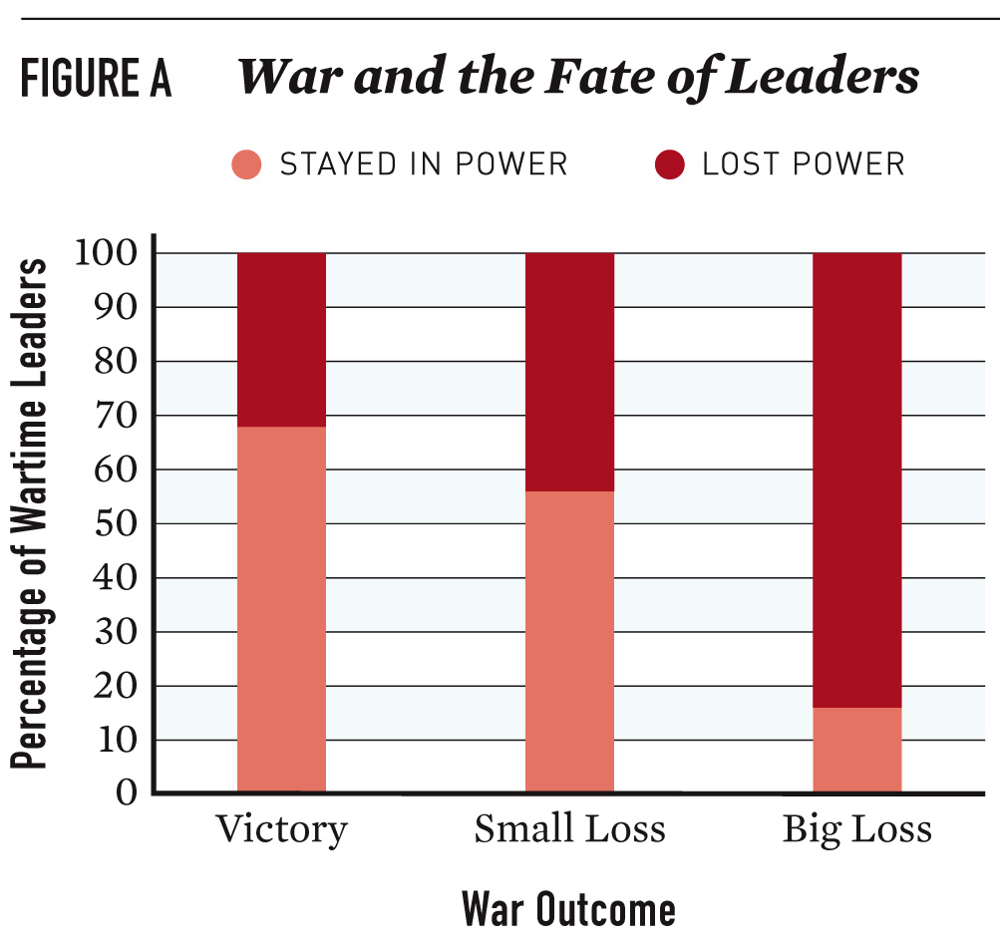
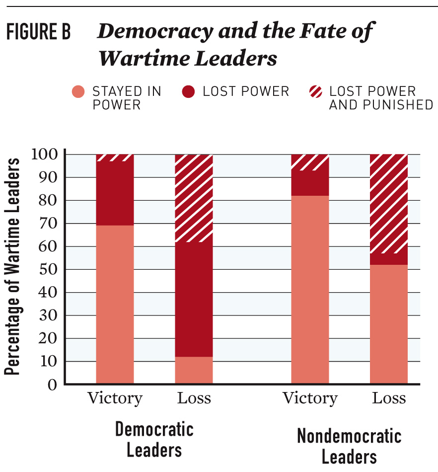

```{r setup, include = FALSE, echo=FALSE, warning=FALSE}
library(ggplot2)
library(data.table)
library(peacesciencer)
library(tidyverse)
library(janitor)
library(kableExtra)
library(here)
library(scales)
library(ghibli)
library(lubridate)
library(viridis)
library(rvest)

knitr::opts_chunk$set(comment = '', dpi = 400, fig.width = 8, fig.height = 5, warning = FALSE, echo = FALSE, message = FALSE)

sysfonts::font_add_google("Oswald", family = "oswald")
showtext::showtext_auto()

# Windows and Mac seem to process the font differently
if (Sys.info()[[1]] == "Windows"){

basesize <- 35

} else {
  
basesize <-  11
  
}

update_geom_defaults("text", list(size = 10, family = "oswald", fontface = "plain", lineheight = 0.2))


# Regular plot theme
theme_flynn <- function(){ 
  
      theme_linedraw(base_size = basesize, base_family = "oswald") %+replace% 
        
        theme(plot.title = element_text(face = "bold", size = basesize * 1.3, hjust = 0, margin = margin(t = 0, b = 0.2, l = 0, r = 0, unit = "cm")),
              plot.subtitle = element_text(size = basesize, hjust = 0, margin = margin(t = 0.0, b = 0.2, unit = "cm")),
              plot.caption = element_text(face = "italic", size = basesize * 0.6, hjust = 1, lineheight = 1, margin = margin(t = 0.2, unit = "cm")),
              panel.border = element_rect(fill = NA, size = 0.2),
              strip.background = element_rect(fill = "gray80", color = "black", size = 0.2),
              strip.text = element_text(size = basesize, color = "black", face = "bold", margin = margin(t = 0.2, b = 0.2, l = 0.2, r = 0.2, unit = "cm")),
              panel.background = element_rect(size = 0.2),
              panel.grid.major = element_line(color = "gray70", size = 0.15),
              panel.grid.minor = element_line(color = "gray90", size = 0.1),
              axis.title = element_text(face = "bold", size = basesize),
              axis.title.y = element_text(angle = 90, margin = margin(t = 0, r = 0.2, b = 0, l = 0, unit = "cm")),
              axis.title.x = element_text(margin = margin(t = 0.2, r = 0, b = 0, l = 0, unit = "cm")),
              axis.ticks = element_line(size = 0.1),
              axis.ticks.length = unit(0.1, "cm"),
              legend.title = element_text(size = basesize, face = "bold", hjust = 0, margin = margin(t = 0, b = -0.3, l = 0, r = 0, unit = "cm")),
              legend.text = element_text(margin = margin(l = -0.3, unit = "cm")),
              plot.margin = margin(0.5, 0.5, 0.5, 0.5, unit = "cm"),
              legend.margin = margin(t=0, b=0, r=0, l=0),
              legend.box.margin = margin())
}

theme_flynn_map <- function(){
  
      theme_void(base_size = basesize, base_family = "oswald") %+replace% 
    
    theme(plot.title = element_text(face = "bold", size = 18, hjust = 0, margin = margin(t = 0, b = 0.3, l = 0, r = 0, unit = "cm")),
          plot.subtitle = element_text(size = 12, hjust = 0, margin = margin(t = 0, b = 0.3, l = 0, r = 0, unit = "cm")),
          plot.caption = element_text(face = "italic", size = 8, hjust = 1, margin = margin(t = 0.2, unit = "cm")),
          plot.background = element_rect(fill = "white", color = "white"),
          strip.background = element_rect(fill = "gray80", color = "black"),
          strip.text = element_text(color = "black", face = "bold"),
          panel.grid.major = element_line(color = "white", size = 0),
          panel.grid.minor = element_line(color = "white", size = 0),
          #axis.title = element_text(face = "bold", size = 0),
          #axis.title.y = element_text(margin = margin(t = 0, r = 0.5, b = 0, l = 0, unit = "cm")),
          #axis.title.x = element_text(margin = margin(t = 0.5, r = 0, b = 0, l = 0, unit = "cm")),
          legend.title = element_text(face = "bold"),
          legend.position = "bottom",
          legend.key.height = unit(0.6, "cm"),
          legend.key.width = unit(2.5, "cm"))
}


#install.packages("RefManageR")

#library(RefManageR)
#library(bibtex)
#BibOptions(check.entries = FALSE,
#           bib.style = "authoryear", # Bibliography style
#           max.names = 3, # Max author names displayed in bibliography
#           sorting = "nyt", #Name, year, title sorting
#           cite.style = "authoryear", # citation style
#           style = "markdown",
#           hyperlink = FALSE,
#           dashed = FALSE)

#myBib <- ReadBib(here::here("../../classrefs.bib", check = FALSE))

```

# Lecture Overview

1. The purpose of war
2. Breaking down the state
3. Thinking about interests and war
4. Institutions and war


---

# Key Questions and Goals

1. What is the purpose of war?
2. How do different societal groups influence policy?
3. What are examples of "interest groups"?
4. What is the "rally" effect?
5. Describe the ways in which institutions can affect the likelihood of conflict?


---
class: center, middle, inverse

# The Purpose of War


---
# The Purpose of War?

War—what is it good for?

- Two conceptualizations:

  - War serves the national interest
  
  - War serves interests of more narrow social groups
  
  
  
---
# The Purpose of War?

War and the national Interest

- War advances or preserves broad, shared interests

- War is for the "common good"

- We can think of broad concepts like "national security", "national defense", etc.


---
# The Purpose of War?
  
War and narrow interests

- War advances or preserves more narrow, particularistic interests

- These are interests of a more specific subset of the population

- But who?

  - Industries
  - Lobbies
  - Economy
  
  
  
---
# The Purpose of War?


.pull-left[
Public Goods

- Available to all

- Non-excludable

- Non-rival

- Examples include national defense, clearn air, etc.
]

.pull-right[
Private Goods

- Available to some

- Excludable

- Rival

- Examples include import tariffs, subsidies, monopolies, contracts/grants, etc.
]


---
class: center, inverse, middle

# Breaking Down the State


---
# Breaking Down the State

We talk a lot about the "state", but who are we really talking about?

- Realist or higher level theories often treat states as unitary actors, but reality is obviously more complex

- States are composed of some key groups

  - Leaders
  - Bureaucrats
  - Interest Groups
  - General Public
  
  

---
# Breaking Down the State

Leaders

- Heads of state
- Heads of government
- Legislators
- Policymakers
- Bureaucrats


---
# Breaking Down the State

Bureaucrats

- Aids and advisers to heads of state/government
- Policymakers within larger organizations (e.g. State, DoD, etc.)
- Military personnel
- Diplomats


---
# Breaking Down the State

Interest Groups

- Businesses
- Labor groups
- Military personnel
- Government workers
- Religious and/or ethnic groups
- Human rights organizations


---
# Breaking Down the State

General Public

- You
- You
- You
- You
- You
- You
- You
- And, you
- You
- You, too


---
class: middle, inverse, center

# Interests and War


---
# Interests and War

Whose interests does war serve?

--

It depends

We first have to understand what groups want

--

So what *do* these actors want?

--

Well, we have to make some assumptions:

- Policymakers: To stay in office
- Interest groups: To advance their organizational interests (money, budgets, etc.)
- General public: ¯\ \_(ツ)\_/¯ 


---
# Interests and War

The Rally Effect

- The use of military force can raise nationalistic sentiments

- This can be in response to an attack or as a result of initiating conflict

- This may give leaders a boost in public support


---
class: center, middle

```{r george-w-bush-approval}


# Note that str_sub works with the -2 and -1 to target characters at end of the string, but substr does not.
approve <- fread(here::here("../../../Data Files/us_presidential_approval.csv")) %>% 
  mutate(netfav = approve-(disapprove),
         month = gsub("/", "", substr(start, 1, 2)),
         year = str_sub(end, -2, -1),
         year2 = as.numeric(year) + 1900,
         year3 = ifelse(year2 <= 1930, year2 + 100, year2),
         date = as.Date(paste(year3, month, 1, sep = "-"))) %>% 
         group_by(president, date) %>% 
         dplyr::summarise(netfav = mean(netfav), approve = mean(approve)) %>% 
  mutate(party = as.factor(ifelse(president == "Eisenhower" | president == "Nixon" | president == "Ford" | president == "Reagan" | president == "Bush" | president == "W_Bush" | president == "Trump", "Republican", "Democrat")),
         begin = as.Date(min(date)),
         end = as.Date(max(date))) %>% 
  group_by(., president) %>% 
  arrange(., president, date) %>% 
  ungroup()
  
approve_short <- approve %>% 
  group_by(president, party) %>% 
  dplyr::summarise(begin = min(begin), end = max(end)) %>% 
  arrange(begin) %>% 
  ungroup() %>% 
  mutate(begin2 = c("1933-03-04", "1945-04-12", "1953-01-20", "1961-01-20", "1963-11-22", "1969-01-20", "1974-08-01", "1977-01-20", "1981-01-20", "1989-01-20", "1993-01-20", "2001-01-20", "2009-01-20", "2017-01-20"),
         end2 = c("1945-04-12", "1953-01-20", "1961-01-20", "1963-11-22", "1969-01-20", "1974-08-01", "1977-01-20", "1981-01-20", "1989-01-20", "1993-01-20", "2001-01-20", "2009-01-20", "2017-01-20", "2018-07-20"),
         begin2 = as.Date(begin2),
         end2 = as.Date(end2))

ggplot(data = subset(approve, president == "W_Bush"), aes(x = date, y = netfav)) +
  geom_point() +
  geom_line() +
  geom_vline(xintercept = as.Date("2001-09-01"), colour = "red") +
  geom_vline(xintercept = as.Date("2003-03-01"), colour = "red") +
  annotate("text", x = as.Date("2002-03-11"), y = -20, label = "September 11 Attacks", size = 10) +
  annotate("text", x = as.Date("2003-08-20"), y = -20, label = "Invasion of Iraq", size = 10) +
  theme_flynn() +
  scale_x_date(date_breaks = "1 years", date_labels = "%Y") +
  scale_y_continuous(breaks = seq(-50, 100, 20), limits = c(-50,90)) +
  labs(title = "George W. Bush approval ratings over time", 
       subtitle = "National security crises can affect public opinion, but effects are often short-lived",
       x = "Date", y = "Net favorability %", 
       fill = "Party", 
       caption = "Monthly mean approval score shown \n Data obtained from: http://www.presidency.ucsb.edu/data/popularity.php") 
```


---
# Interests and War

Diversionary Incentive

- Leaders want to remain in office but may have limited policy tools available

- Because leaders are aware of the rally effect, they have an incentive to use military force to remedy political problems

- "Gambling for resurrection"

- Various conditions might incentivize such behavior

  - High unemployment
  - High inflation
  - Civil unrest
  - Political scandals
  
  

---
class: center, middle



<caption>Headline from the New York Times discussing Clinton impeachment scandal alongside attacks on suspected terrorist sites.</caption>


---
class: center, middle

```{r, out.width="40%", fig.cap="TEST TESTING!"}
knitr::include_graphics("../images/clinton-impeachment-headline.PNG", error = FALSE)
```


---
# Interests and War

Reasons to be skeptical

- Evidence is mixed

- Is it even effective?

- Strategic avoidance

- Capabilities

- Risky


---
class: center, middle

```{r afghanistan fatalities}

afghan_fatality_wide <- fread(here::here("../../../Data Files/US Afghanistan Deaths.csv"))

afghan_fatality_long <- gather(afghan_fatality_wide, month, deaths, -year) %>% 
  group_by(year) %>% 
  mutate(month = str_extract(month, "[:digit:]{1,2}"),
         date = paste(year, month, 1, sep = "-"),
         date = as.Date(date, format = "%Y-%m-%d"),
         `Season` = as.factor(ifelse(month >= 11 | month <= 4, "Growing", "Fighting"))) 

war_opinion <- fread(here::here("../../../Data Files/Gallup Polling Data/Iraq War a Mistake.csv")) %>% 
  filter(conflictname == "Afghanistan") %>% 
  mutate(year = substr(V1, 1, 4),
         month = substr(V1, 6, 8),
         date = paste(year, month, 1, sep = "-"),
         date = as.Date(date, format = "%Y-%b-%d"))

combined <- merge(war_opinion, afghan_fatality_long, by.x = "date", by.y = "date", all.x = TRUE, all.y = TRUE)

ggplot(data = combined, aes(x = date)) +
  geom_bar(stat = "identity", aes(y = deaths, group = `Season`), fill = "#A1B1C8FF") +
  geom_point(aes(y = Mistake), fill = "red", size = 4, alpha = .7, shape = 21) +
  theme_flynn() +
  scale_x_date(breaks = seq(as.Date("2001-10-1"), as.Date("2016-12-1"), by = "3 years"), labels = date_format("%B %Y")) +
  scale_y_continuous(breaks = seq(0,125,20), sec.axis = sec_axis(~.+0, name = "War a Mistake (Percent)", breaks = seq(0,100,20))) +
  scale_fill_brewer(type = "qual", palette = 7, direction = 1) +
  labs(title = "US military fatalities in Afghanistan by month, 2001-2014", 
       subtitle = "Popularity of the war does not track ups and downs of casualties",
       x = "",
       y = "Count",
       caption = "Casualty data obtained from http://icasualties.org/OEF/ByMonth.aspx.") 

```


---
class: center, middle

```{r iraq-fatalities}

# Create empty list to enter new data tables
# 

if (file.exists(here::here("../../../Data Files/icasualties/iraq-fatalities-data.csv"))) {

    iraq.fatalities <- fread("../../../Data Files/icasualties/iraq-fatalities-data.csv")
    
    } else {
    
table.list <- list()

for(i in 1:50){
  
  page <- read_html(glue::glue("http://icasualties.org/App/Fatalities?page={i}&rows=100"))
  
  table.list[i] <- page %>% html_table(fill = TRUE)

}

iraq.fatalities <- data.table::rbindlist(table.list)

fwrite(iraq.fatalities, file = here::here("../../../Data Files/icasualties/iraq-fatalities-data.csv"))

}

iraq.fatalities.month <- iraq.fatalities %>% 
  filter(Nationality == "United States") %>% 
  mutate(date = format(mdy(Date), "%Y-%m")) %>% 
  group_by(date) %>% 
  dplyr::summarise(fatalities = n_distinct(Name)) %>% 
  mutate(date = ymd(glue::glue("{date}-01")))

# Check this to make sure the index under html_table is accurate if I update again. The table position might change over time.
iraq.gallup <- read_html("https://news.gallup.com/poll/1633/iraq.aspx") %>% 
  html_table(fill = TRUE)

iraq.polling.df <- iraq.gallup[[3]] %>% 
  dplyr::rename("date" = 1, "mistake" = 2, "notmistake" = 3) %>% 
  dplyr::select(date, mistake, notmistake) %>% 
  slice(-c(1:2)) %>% 
  mutate(year = str_extract(date, "\\d\\d\\d\\d"),
         month = str_extract(date, "[:alpha:]+")) %>% 
  filter(!is.na(year)) %>% 
  mutate(month = gsub("March", "Mar", month),
         date = as.Date(ymd(glue::glue("{year}-{month}-01"))),
         mistake = as.numeric(mistake))

iraq.combined <- iraq.fatalities.month %>% 
  left_join(iraq.polling.df) %>% 
  mutate(date = as.Date(ym(date)),
         mistake = as.numeric(mistake))


# Note you have to multiple the point data to map it accurately against the second axis scale.
ggplot() +
  geom_bar(data = iraq.fatalities.month, stat = "identity", aes(x = date, y = fatalities), fill = "#A1B1C8FF") +
  geom_point(data = iraq.polling.df, aes(x = date, y = mistake*1.25), fill = "red", size = 4, alpha = .7, shape = 21) +
  theme_flynn() +
  scale_x_date(breaks = seq(as.Date("2003-10-01"), as.Date("2019-01-01"), by = "3 years"), labels = date_format("%B %Y")) +
  scale_y_continuous(breaks = seq(0,125,25), sec.axis = sec_axis(~./1.25, name = "War a Mistake (Percent)", breaks = seq(0,100,20))) +
  scale_fill_brewer(type = "qual", palette = 7, direction = 1) +
  labs(title = "US military fatalities in Iraq by month, 2003-2019", 
       subtitle = "Popularity of the war does not track ups and downs of casualties",
       x = "",
       y = "Count",
       caption = "Casualty data obtained from http://icasualties.org/App/Fatalities.") 

```


---
class: center, middle

```{r vietnam-opinion}

data <- fread(here::here("../../../Data Files/US Government Files/National Archives/DCAS.VN.EXT08.DAT")) %>% 
  dplyr::select(V1,V5,V7,V35,V39,V45)   %>% 
  filter(V45 == "DIED OF WOUNDS" | V45 == "KILLED IN ACTION" | V45 == "ACCIDENT")  %>% 
  mutate(date = as.Date(ymd(V35)),
         Service = V7) %>% 
  group_by(Service, month = floor_date(date, "month")) %>%  
  dplyr::summarise(killed = n_distinct(V5)) 

opinion <- fread(here::here("../../../Data Files/RAND/vietnam-opinion.csv")) %>% 
  mutate(across(everything(), 
                ~gsub('"|,', "", .x))) %>% 
  mutate(year = V2,
         month = V1,
         deaths = V3,
         approve = V4,
         date = as.Date(ymd(glue::glue("{year}-{month}-01")))) %>% 
  dplyr::select(deaths,approve,date) %>% 
  mutate(month = date,
         disapprove = as.numeric(100-as.numeric(approve)),
         approve = as.numeric(approve)) %>% 
  arrange(month) 


combined <- tibble(month = seq(as.Date("1960-01-01", origin = "1900-01-01"), as.Date("1974-01-01", origin = "1900-01-01"), by = "1 month")) %>% 
  left_join(data) %>% 
  spread(key = Service, value = killed, fill = 0) %>% 
  gather(key = Service, value = killed, -month) %>% 
  arrange(Service, month) %>% 
  filter(killed != "<NA>") %>% 
  mutate(Service = forcats::fct_relevel(Service, "COAST GUARD", "AIR FORCE", "NAVY", "MARINE CORPS", "ARMY"),
         month = as.Date(month)) %>% 
  arrange(month, Service) %>% 
  subset(Service != "<NA>") %>% 
  ungroup() %>% 
  group_by(month) %>% 
  mutate(totaldeaths = sum(killed),
         propdeath = killed/totaldeaths) 

#ghibli::ghibli_palettes$TotoroLight
# Monthly deaths and public opinion
ggplot() +
  geom_bar(data = combined %>% filter(month <= as.Date("1974-01-01") & month >= as.Date("1964-01-01")), 
           aes(x = month, y = killed), 
           stat = "identity", 
           position = "stack",
           fill = "#A1B1C8FF") +
  geom_point(data = opinion, aes(x = month, y = approve*25), shape = 21, fill = "red", alpha = .7, size = 4) +
  theme_flynn() +
  theme(plot.caption = element_text(lineheight = 0.3)) +
  scale_x_date(breaks = seq(as.Date("1964-01-01"), as.Date("1974-01-01"), by = "1 year"), labels = date_format("%b %y"), limit = c(as.Date("1964-01-01"), as.Date("1974-01-01"))) +
  scale_y_continuous(breaks = seq(0, 2500, 500), limits = c(0, 2500), sec.axis = sec_axis(~./25, name = "Approval (Percent)", breaks = seq(0,100,20))) +
  labs(x = "",
       y = "Count",
       title = "US military fatalities in Vietnam by month, 1964-1973",
       subtitle = "Popularity of the war does not track ups and downs of casualties",
       caption = "Count totals include 'killed in action', accidents', and 'died of wounds'. \n Public opinion data obtained from RAND report: Casualties and Consensus
The Historical Role of Casualties in Domestic Support for U.S. Military Operations. \n Fatality data taken from https://www.archives.gov/research/military/vietnam-war/casualty-statistics.")

```


---
class: center, middle




---
class: center, middle




---
# Interests and War

.pull-left[
Special Interests

- Some groups may benefit disproportionately from war while paying few of the costs

- Also suggests a disproportionate ability to influence the decision to use force in the first place

- Classic collective action problems
]

.pull-right[
```{r, out.width="65%", fig.align="center"}
knitr::include_graphics("https://ih1.redbubble.net/image.577642334.9323/flat,750x,075,f-pad,750x1000,f8f8f8.u1.jpg")
```
]


---
class: left, top

# Interests and War

.pull-left[
Special Interests

- United Fruit Company in Guatemala

- In 1954 the US/CIA helped to overthrow democratically elected Jacobo Arbenz

- Arbenz implemented land reforms, labor-friendly policies

- Communist!
]

.pull-right[

]


---

# Interests and War

Reasons to be skeptical

- Arbenz implemented many worker-friendly policies

- Cold War made Western governments very wary of anything remotely resembling Communism

- US intervened in many other countries where such strong ties did not exist


---

# Interests and War

The Military

- Maintain edge over potential threats and peer competitors 

- Training and role predispose military leaders to see military solutions to problems

- Makes organization relevant


---

# Interests and War

Reasons to be skeptical

- Evidence indicates prior military experience makes policymakers (in US) less likely to initiate the use of force

- No evidence that military leaders can use positions to substantially influence spending decisions


---
class: center, middle, inverse

# Regime Type and War


---
class: left, top

# Regime Type and War


Classical Liberal Theory

- Democracy should curb belligerent behavior

  - Elections
  
  - Separation of powers
  
  - Norms
  
- Empirical evidence shows reality is more complicated


---

# Regime Type and War

What is democracy?

> A political system in which candidates compete for political office through frequent, fair elections in which a sizeable portion of the adult population can vote (FLS)


---

# Regime Type and War


Non-Democracies (everything else)

> **Autocracies**: In mature form, autocracies sharply restrict or suppress competitive political participation. Their chief executives are chosen in a regularized process of selection within the political elite, and once in office they exercise power with few institutional constraints (Polity IV Project Codebook, 15)

> **Anocracy**: Regimes that exhibit a mixture of democratic and autocratic characteristics


---
class: center, middle

```{r}

democracy <- peacesciencer::create_stateyears(syste = "cow") %>% 
  add_democracy() %>% 
  filter(ccode == 2)

ggplot(democracy, aes(x = year, y = polity2)) +
  geom_line(size = 0.8) +
  geom_point(size = 2.5) +
  geom_vline(xintercept = 1920, color = "red", size = 1.2) +
  annotate("text", hjust = 0, x = 1925, y = 4, label = "19th Amendment ratified\nAugust 20, 1920", size = 15) +
  theme_flynn() +
  scale_y_continuous(breaks = seq(-10, 10, 1), limits = c(-10, 10)) +
  scale_x_continuous(breaks = seq(1815,2025, 15)) +
  labs(x = "Year",
       y = "Polity Score",
       title = "Polity scores for the United States, 1816-2017",
       subtitle = "By this definition the US is a full democracy whilel half the population cannot legally vote")
```


---
class: center, middle

```{r}

library(patchwork)

democracy <- peacesciencer::create_stateyears(syste = "cow") %>% 
  add_democracy() %>% 
  filter(ccode == 2)

p1 <- ggplot(democracy, aes(x = year, y = polity2)) +
  geom_line(size = 0.8, color = "dodgerblue1") +
  theme_flynn() +
  scale_y_continuous(breaks = seq(-10, 10, 1), limits = c(-10, 10)) +
  scale_x_continuous(breaks = seq(1815,2025, 15)) +
  labs(x = "Year",
       y = "Polity Score",
       title = "Polity scores for the United States, 1816-2017")


p2 <- ggplot(democracy, aes(x = year, y = v2x_polyarchy)) +
  geom_line(size = 0.8, color = "dodgerblue1") +
  theme_flynn() +
  scale_y_continuous(limits = c(-3, 3)) +
  scale_x_continuous(breaks = seq(1815,2025, 15)) +
  labs(x = "Year",
       y = "Polyarchy Score",
       title = "Polyarchy scores for the United States, 1816-2017")

p.com <- p1 | p2

p.com
```


---
# Regime Type and War

Selectorate Theory

- Society

- Selectorate

- Winning Coalition


---
# Regime Type and War

Balance between public and private goods

- Small winning coalitions provide more private goods

- Larger winning coalitions provide more public goods

- War and its spoils can be thought of as private good

- Costs of war not incurred by the winning coalition

- To put it differently, benefits of war are concentrated and costs are diffuse

---
class: center, middle

```{r selectorate}
library(ggforce)
library(ggrepel)

circles <- data.frame(
  x0 = rep(0, 3),
  y0 = rep(0, 3),
  r = c(0.5, 1.0, 1.5),
  label = c("Winning Coalition", "Selectorate",  "Population")
)


plot.1 <- ggplot(data = circles) +
  geom_circle(aes(x0 = x0, y0 = y0, r = r, fill = r), alpha = 0.4, show.legend = FALSE) +
  geom_label_repel(aes(x = r, y = r, label = label), size = basesize) +
  coord_fixed() +
  theme_void() +
  theme(plot.title = element_text(size = basesize * 1.5, family = "oswald", face = "bold")) 

plot.1

```


---
class: center, middle

```{r selectorate-2}
library(ggforce)
library(ggrepel)

circles <- data.frame(
  x0 = rep(0, 3),
  y0 = rep(0, 3),
  r = c(0.2, 0.80, 2.0),
  label = c("Winning Coalition", "Selectorate",  "Population")
)


plot.2 <- ggplot(data = circles) +
  geom_circle(aes(x0 = x0, y0 = y0, r = r, fill = r), alpha = 0.4, show.legend = FALSE) +
  geom_label_repel(aes(x = r, y = r, label = label), size = basesize) +
  coord_fixed() +
  theme_void() +
  theme(plot.title = element_text(size = basesize * 1.5, family = "oswald", face = "bold")) 

plot.2

```


---
# Regime Type and War

Empirical evidence shows us that

- Democracies fight as much as non-democracies 

- Democracies tend to fight with non-democracies

- Mature democracies don't fight one another

- States in transition to democracy may be more belligerent

- Democracies tend to win the fights they get into

- Single-party autocracies intiate conflict at about the same rate as democracies. Constraining effect.


---
class: center, middle

```{r, dpi = 400, echo = FALSE, warning = FALSE}
library(dagitty)
library(ggdag)
library(ggrepel)

dag.df <- dagitty(' dag{
                  "Democracy" [exposure]
                  "Peace" [outcome]
                  
                  "Democracy" [pos="1,1"]
                  "Peace" [pos="2,1"]
                  "Trade" [pos="1.5,2"]
                  
                  "Democracy" -> "Peace"
                  
}') %>% 
  tidy_dagitty()


ggplot(dag.df %>% filter(name != "Trade"), aes(x = x, xend = xend, y = y, yend = yend)) +
  geom_dag_point(aes(color = name), show.legend = FALSE, size = 20) +
  geom_dag_edges() +  
  geom_dag_label_repel(aes(label = name), color = "black", size = 25, parse = TRUE) +
  theme_dag() +
  viridis::scale_color_viridis(discrete = TRUE, begin = 0.1, end = 0.9) 

```


---
class: center, middle

```{r, dpi = 400, echo = FALSE, warning = FALSE}
library(dagitty)
library(ggdag)
library(ggrepel)

dag.df <- dagitty(' dag{
                  "Democracy" [exposure]
                  "Peace" [outcome]
                  
                  "Democracy" [pos="1,1.5"]
                  "Peace" [pos="2,1.5"]
                  "Trade" [pos="1.5,2"]
                  "Constraints" [pos="1.5,1.8"]
                  "Norms" [pos="1.5,1.6"]
                  "Alliances" [pos="1.5,1.4"]
                  "Credibility" [pos="1.5,1.2"]
                  "Transparency" [pos="1.5,1.0"]

                  "Democracy" -> "Trade" -> "Peace"
                  "Democracy" -> "Norms" -> "Peace"
                  "Democracy" -> "Constraints" -> "Peace"
                  "Democracy" -> "Alliances" -> "Peace"
                  "Democracy" -> "Credibility" -> "Peace"
                  "Democracy" -> "Transparency" -> "Peace"
                  
}') %>% 
  tidy_dagitty()


ggplot(dag.df , aes(x = x, xend = xend, y = y, yend = yend)) +
  geom_dag_point(aes(color = name), show.legend = FALSE, size = 20) +
  geom_dag_edges() +  
  geom_dag_label_repel(aes(label = name), color = "black", size = 25, parse = TRUE) +
  theme_dag() +
  viridis::scale_color_viridis(discrete = TRUE, begin = 0.1, end = 0.9) 

```
